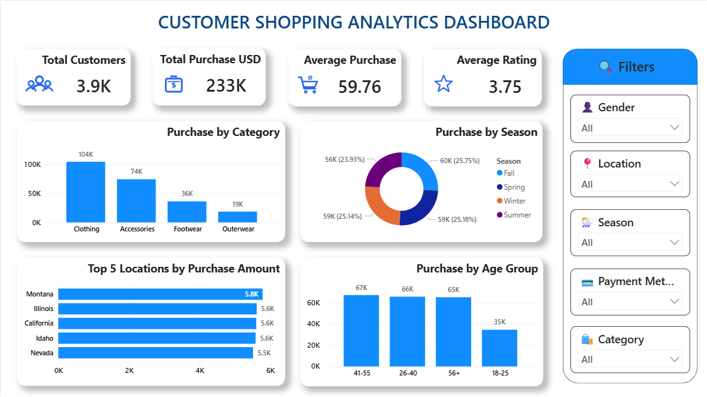

# 🛍️ Customer Segmentation using K-Means Clustering

This project analyzes customer shopping behavior and applies **K-Means Clustering** to segment customers into meaningful groups based on purchasing patterns and demographics. The analysis combines business intelligence and machine learning techniques to uncover customer insights and support targeted marketing strategies.

# 🧾 Overview

The goal of this project is to understand customer shopping behavior, identify spending patterns, evaluate discount opportunities, and segment customers into distinct groups for data-driven decision-making.

The workflow includes:

* Data preparation and cleaning
* Business analysis using Power BI
* Discount and spending analysis
* Customer segmentation using K-Means clustering
* Business recommendations based on customer segments

# 🎯 Problem Statement

Retail businesses often struggle to understand diverse customer purchasing behaviors and effectively target different customer groups.

This project aims to:

* Analyze customer shopping behavior and spending patterns
* Identify categories suitable for discount-focused strategies
* Evaluate the impact of age, payment methods, seasons, and locations on purchases
* Segment customers using K-Means clustering
* Generate targeted marketing recommendations

# 🗂️ Dataset Summary

**Records:** 3,900 Customer Transactions

### 🔍 Key Features

* Age
* Gender
* Location
* Category
* Purchase Amount (USD)
* Season
* Payment Method
* Review Rating
* Discount Applied
* Previous Purchases
* Frequency of Purchases

The dataset provides valuable insights into customer preferences, spending habits, and shopping trends.

# 🛠️ Tools & Technologies

* Power BI
* Power Query
* Orange Data Mining
* Machine Learning (K-Means Clustering)
* Excel / CSV

# 🔧 Project Workflow

### 1. Data Preparation

* Imported and cleaned customer shopping data
* Prepared features for analysis and clustering

### 2. Business Analysis

* Created interactive Power BI dashboards
* Analyzed category performance, purchase trends, customer spending, and location-based insights

### 3. Customer Segmentation

* Applied K-Means clustering using **Age** and **Purchase Amount**
* Segmented customers into:

  * High Value Customers
  * Medium Value Customers
  * Low Value Customers

### 4. Business Recommendations

* Developed targeted marketing strategies for each customer segment

# 📊 Dashboard Screenshots

## Customer Shopping Analytics Dashboard

## Discount Analysis

## Customer Segmentation Analysis

## Age, Payment & Location Analysis

# 📈 Key Insights

### Discount Analysis

* Clothing generated the highest purchase amount and customer count.
* Accessories ranked second in overall contribution.
* Discount-focused campaigns are most effective for Clothing and Accessories.

### Spending Analysis

* Customers aged 26–40 and 41–55 showed higher spending levels.
* Credit Card and Venmo users contributed significantly to purchases.
* Montana, Illinois, and California were among the highest-spending locations.

### Customer Segmentation

* Medium Value Customers represent the largest customer segment.
* High Value Customers have the highest average purchase amount.
* Age and Purchase Amount were the dominant factors used for segmentation.

# 🎯 Business Recommendations

* Prioritize discounts for Clothing and Accessories.
* Focus marketing efforts on high-spending age groups.
* Create loyalty programs for High Value Customers.
* Use personalized offers for Medium Value Customers.
* Launch reactivation campaigns for Low Value Customers.

# 📬 Contact

**Email:** <a href="mailto:vipinsuryavanshi.vs@gmail.com">[vipinsuryavanshi.vs@gmail.com](mailto:vipinsuryavanshi.vs@gmail.com)</a>

**LinkedIn:** <a href="https://linkedin.com/in/vipin-suryavanshi">Vipin Suryavanshi</a>

**GitHub:** <a href="https://github.com/vipin-s27">vipin-s27</a>
